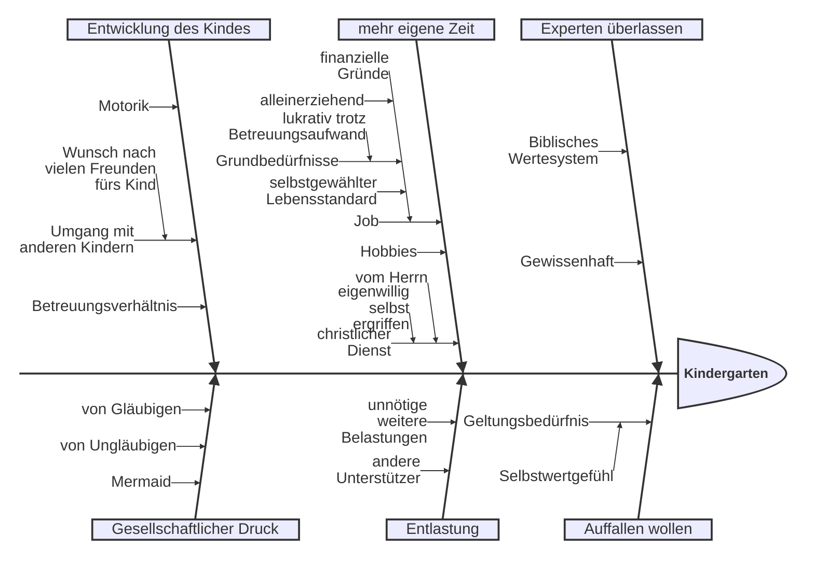

---
# try also 'default' to start simple
theme: default
# random image from a curated Unsplash collection by Anthony
# like them? see https://unsplash.com/collections/94734566/slidev
background: https://cover.sli.dev
# some information about your slides (markdown enabled)
title: Jetzt zählts'!
info: |
  Heute dankbar und entschlossen mit Ziel dienen
# apply UnoCSS classes to the current slide
titleTemplate: '%s'
class: text-center
# slide transition: https://sli.dev/guide/animations.html#slide-transitions
transition: slide-left
# enable Comark Syntax: https://comark.dev/syntax/markdown
comark: true
# favicon: 'https://cdn.jsdelivr.net/gh/slidevjs/slidev/assets/favicon.png'
---

# Jetzt zählt's

<div>
<Tooltip text="Er aber sprach: Mein Sohn soll nicht mit euch hinabziehen; denn sein Bruder ist tot, und er allein ist übrig geblieben, und begegnete ihm ein Unfall auf dem Weg, auf dem ihr zieht, so würdet ihr mein graues Haar mit Kummer hinabbringen in den Scheol. (1. Mo 42,38)" href="https://www.csv-bibel.de/bibel/1-mose-42#v38">1. Mose 42,38</Tooltip>
</div>

<Tooltip text="die die gelegene Zeit auskaufen, denn die Tage sind böse" href="https://www.csv-bibel.de/bibel/1-mose-42#v38">Epheser 5,16</Tooltip>

---
layout: two-cols
layoutClass: gap-16
level: 1
---

# Intro

Dankbar leben.

Bewusst dienen.

Ganz im Hier und Jetzt.

::right::

<Toc text-sm minDepth="1" maxDepth="2" />

---
layout: two-cols
level: 1
---

# Dankbar im Heute


::right::
<div>
<Tooltip
  text="Und der Friede des Christus regiere in euren Herzen, zu dem ihr auch berufen worden seid in einem Leib; und seid dankbar. (Kol 3,15)"
  href="https://www.csv-bibel.de/bibel/kolosser-3#v15"
>
  Kolosser 3,15
</Tooltip>
</div>
<div class="h-full flex items-center">


</div>

---
level: 2
transition: slide-up
---

# 🗯️ 1

Versetzt euch in die Lage älterer Gruppenmitglieder. Nennt den jeweils älteren Dinge, wofür sie eurer Vorstellung nach besonders dankbar sein dürfen.

💡 Tipp: Zuhören, nicht widersprechen.

---
level: 1
layout: cover
background: ./images/zielscheibe.jpg
---

# Ziel


<Tooltip text="Denn welche er zuvorerkannt hat, die hat er auch zuvorbestimmt, dem Bild seines Sohnes gleichförmig zu sein, damit er der Erstgeborene sei unter vielen Brüdern" href="https://www.csv-bibel.de/bibel/roemer-8#v29">Römer 8,29</Tooltip>


---
level: 2
transition: slide-up
---

# 🗯️ 2

1. Bei welchen Ziel-Aspekten fällt es dir besonders schwer, dich mit zu identifizieren.
1. Warum?


---
level: 1
class: text-center
# background: verschwommene Zielscheibe
---

# Was zählt? Über Prioritäten & Fokus

---
level: 2
class: text-center bg-black text-white
---

# Stille Zeit

---
level: 2
class: text-center
# background: Kinderzimmer, Büro auf einem Bild
---

# Evangelisieren

---
level: 2
class: text-center
# background: what's app status screenshot durchgestrichen
---

# Was nicht entscheidend ist

---
level: 1
layout: cover
background: 
---

# Let ~~them~~/him, let me

---
level: 2
transition: slide-up
---

# 🗯️ 3

1. Notiere dir deine persönlichen `let him`-Themen
1. Bei welchem Thema fällt es dir besonders schwer, es an IHN abzugeben?
1. Warum fällt es dir schwer?
1. Tauscht euch über positive und negative Erfahrungen aus, die ihr beim "Abgeben" bereits gesammelt habt.

---
level: 1
---

# Warum - Selbstreflexion




---
level: 2
transition: slide-up
---

# 🗯️ 4

Ihr steht vor der Entscheidung, außen an eurem eigenen Haus ein 2x3m großes Bibel-Plakat anzubringen.
1. Sammelt gemeinsam Gründe, die die dagegen sprechen.
2. Hinterfragt mit mehrfachen "Warums", wie ihr zu diesen Gründen kommt und ob sie <span v-mark.circle.red="0">biblisch</span> haltbar sein.

---
level: 1
---

# Es geht aufwärts
Phil 3,13f

Heb 12,1

1 Joh 2,20

Off 22,20

1 Kor 15,58

---
level: 1
---

# Präsentation

## Quellen

Photo by [Becca Romine](https://unsplash.com/@brecca85?utm_source=unsplash&utm_medium=referral&utm_content=creditCopyText) Romine on [Unsplash](https://unsplash.com/photos/faded-green-lights-digital-wallpaper-Lll4QeybDEg?utm_source=unsplash&utm_medium=referral&utm_content=creditCopyText)

https://pixabay.com/photos/accuracy-dart-goal-direct-hit-454196/

https://waitbutwhy.com/2014/05/life-weeks.html

---

# Clicks Animations

You can add `v-click` to elements to add a click animation.

<div v-click="1">

This shows up when you press <kbd>space</kbd> or <kbd>right</kbd>, or click outside the slide on the right.

```html
<div v-click>This shows up when you trigger a click animation.</div>
```

</div>

<v-click at="2">

The <span v-mark.red="2"><code>v-mark</code> directive</span>
also allows you to add
<span v-mark.circle.orange="3">inline marks</span>
, powered by [Rough Notation](https://roughnotation.com/):

```html
<span v-mark.underline.orange>inline markers</span>
```

</v-click>


---
foo: bar
dragPos:
  square: 691,32,167,_,-16
---

# Draggable Elements

Double-click on the draggable elements to edit their positions.

<br>

###### Directive Usage

```md

```

<br>

###### Draggable Arrow

```md
<v-drag-arrow two-way />
```

<v-drag-arrow pos="67,452,253,46" two-way op70 />
