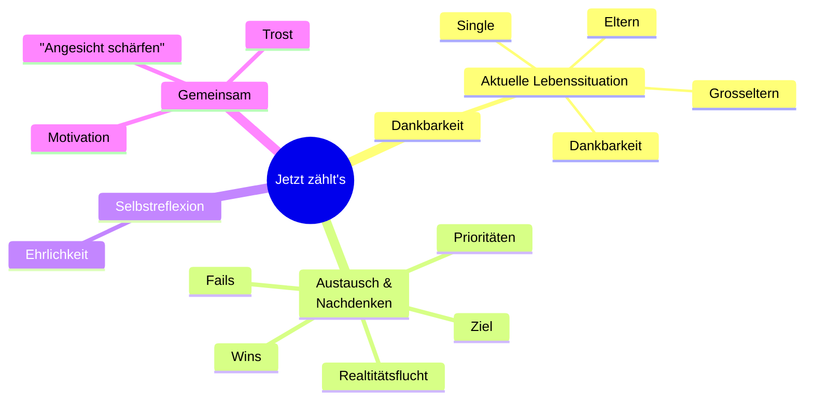
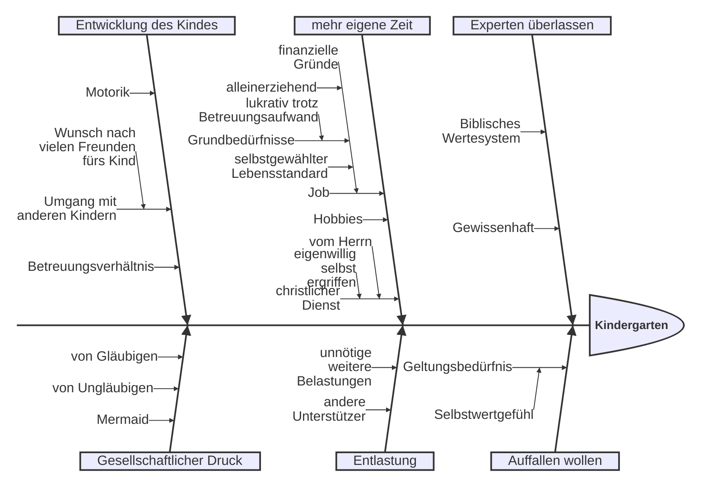

---
# try also 'default' to start simple
theme: default
# like them? see https://unsplash.com/collections/94734566/slidev
# background: https://cover.sli.dev
# some information about your slides (markdown enabled)
title: Jetzt zählts'!
info: |
  Heute dankbar und entschlossen mit Ziel dienen
# apply UnoCSS classes to the current slide
titleTemplate: '%s'
class: text-center
# slide transition: https://sli.dev/guide/animations.html#slide-transitions
transition: slide-left
# enable Comark Syntax: https://comark.dev/syntax/markdown
comark: true
favicon: /images/crosshair.svg
background: /images/slackline.jpg
---

# Jetzt zählt's

 

Dankbar leben.

Bewusst dienen.

Ganz im Hier und Jetzt.

 
<q style="color:yellow">die gelegene Zeit auskaufen, denn die Tage sind böse.</q>

<a href="https://www.csv-bibel.de/bibel/epheser-5#v16">Epheser 5,16</a>

---
transition: slide-up
class: text-center
---

# Inhalt

---
layout: image-right
image: /images/life-overview.png
backgroundSize: 94%
---

# Dankbar | Heute

 
 
<q style="color:#60a5fa">Und seid dankbar.</q>

<a href="https://www.csv-bibel.de/bibel/kolosser-3#v15">Kolosser 3,15</a>

---
layout: image-left
image: /images/ravensbrueck.jpg
level: 2
---

# Dankbar | Allgmein

- Freiheit ⛓️‍💥
- Wohlstand 🪎
- geistlicher Segen 
- christliche Gemeinschaft 🫂
- Adressat für Dankbarkeit: Gott 🤲

---
layout: image-right
image: /images/tagbogen.avif
backgroundSize: 99%
level: 2
---

# Dankbar | Aktuell

👶🧒🙆‍♀️🤰👵🏼

 

<Tooltip
  text="Sein Fleisch wird frischer sein als in der Jugend; er wird zurückkehren zu den Tagen seiner Jünglingskraft."
  href="https://www.csv-bibel.de/bibel/hiob-33#v25"
>
  Hiob 33,25
</Tooltip>

 

<Tooltip
  text="wie Pfeile in der Hand eines Helden, so sind die Söhne der Jugend"
  href="https://www.csv-bibel.de/bibel/psalm-127#v4"
>
  Psalm 127,4
</Tooltip>

 

<Tooltip
  text="Das graue Haar ist eine prächtige Krone: Auf dem Weg der Gerechtigkeit wird sie gefunden."
  href="https://www.csv-bibel.de/bibel/sprueche-16#v31"
>
  Sprüche 16,31
</Tooltip>

 

<Tooltip
  text="Kindeskinder sind die Krone der Alten, und der Schmuck der Kinder sind ihre Väter."
  href="https://www.csv-bibel.de/bibel/sprueche-17#v6"
>
  Sprüche 17,6
</Tooltip>

 
 

> Älter werden mit dem Herrn ist soo toll.
>
> ER regelt alles für mich und ich brauche mich um nichts zu kümmern.

---
level: 2
layout: two-cols-header
---

# Undankbarkeit | Realitätsflucht

::left::

- Vergleiche (1%)
- Ungeduld & Nostalgie
- Eigenwilliger Dienst
- egoistische Me-Time ☕️
- Ausklinken ⚽️ 🛍️  

::right::

- Medien 📖 🎧
- Filme 🧛
- screentime 📱
  - Eskapismus & Emotionsregulation 
  - Schönes übersehen 🙈
- verschlimmert 📉

---
level: 2
transition: slide-up
---

# 🗯️ Austausch # 1 ⏱️ 10 m

 

Versetzt euch in die Lage älterer Gruppenmitglieder. Nennt den jeweils Älteren diejenigen Dinge, wofür sie eurer Vorstellung nach besonders dankbar sein dürfen.

 
 

💡 Tipp: Zuhören, nicht widersprechen 😉

---
layout: image
image: /images/zielscheibe.jpg
---

# Ziel | <Tooltip text="Denn welche er zuvorerkannt hat, die hat er auch zuvorbestimmt, dem Bild seines Sohnes gleichförmig zu sein, damit er der Erstgeborene sei unter vielen Brüdern." href="https://www.csv-bibel.de/bibel/roemer-8#v29">Römer 8,29</Tooltip>

Für dich? Für andere?

---
layout: two-cols-header
class: smaller-text
---

# Ziel | Details

::left::

- SEIN Wille im Wie (<Tooltip text="Und er ging ein wenig weiter und fiel auf sein Angesicht und betete und sprach: Mein Vater, wenn es möglich ist, so gehe dieser Kelch an mir vorüber; doch nicht wie ich will, sondern wie du willst." href="https://www.csv-bibel.de/bibel/matthaeus-26#v39">Mt 26,39</Tooltip>) und im Was (<Tooltip text="Und er sprach: Abba, Vater, alles ist dir möglich; nimm diesen Kelch von mir weg! Doch nicht, was ich will, sondern was du willst!" href="https://www.csv-bibel.de/bibel/markus-14#v36">Mk 14,36</Tooltip>)
- <Tooltip text="Und er ist für alle gestorben, damit die, die leben, nicht mehr sich selbst leben, sondern dem, der für sie gestorben und auferweckt worden ist." href="https://www.csv-bibel.de/bibel/2-korinther-5#v15">2. Kor 5,15</Tooltip>: Für Gott leben
- <Tooltip text="Denn sie selbst berichten von uns, welchen Eingang wir bei euch hatten und wie ihr euch von den Götzenbildern zu Gott bekehrt habt, um dem lebendigen und wahren Gott zu dienen" href="https://www.csv-bibel.de/bibel/1-thessalonicher-1#v9">1. Thes 1,9</Tooltip>: Dienst
- <Tooltip text="Geht nun hin und macht alle Nationen zu Jüngern und tauft sie auf den Namen des Vaters und des Sohnes und des Heiligen Geistes und lehrt sie" href="https://www.csv-bibel.de/bibel/matthaeus-28#v19">Mt 28,19f</Tooltip>: Evangelisation
- <Tooltip text="Es kommt aber die Stunde und ist jetzt, da die wahrhaftigen Anbeter den Vater in Geist und Wahrheit anbeten werden; denn auch der Vater sucht solche als seine Anbeter." href="https://www.csv-bibel.de/bibel/johannes-4#v23">Joh 4,23</Tooltip>: Anbetung

::right::

- <Tooltip text="Während sie aber aßen, nahm Jesus Brot, segnete, brach und gab es den Jüngern und sprach: Nehmt, esst; dies ist mein Leib. [27] Und er nahm den Kelch und dankte und gab ihnen diesen und sagte: Trinkt alle daraus" href="https://www.csv-bibel.de/bibel/matthaeus-26#v26">Mt 26,26-27</Tooltip>: 🍞🍷 
- <Tooltip text="So kann nun keiner von euch, der nicht allem entsagt, was er hat, mein Jünger sein." href="https:/www.csv-bibel.de/bibel/lukas-14#v33">Lk 14,33</Tooltip>: Entsagung von allem
- <Tooltip text="Er sprach aber zu allen: Wenn jemand mir nachkommen will, so verleugne er sich selbst und nehme täglich sein Kreuz auf und folge mir nach." href="https://www.csv-bibel.de/bibel/lukas-9#v23">Lk 9,23</Tooltip>: Tägliche Selbstverleugnung
- <Tooltip text="Denn was für ein Ruhm ist es, wenn ihr ausharrt, indem ihr sündigt und geschlagen werdet? Aber wenn ihr ausharrt, indem ihr Gutes tut und leidet, das ist wohlgefällig bei Gott." href="https://www.csv-bibel.de/bibel/1-petrus-2#v20">1. Pet 2,20</Tooltip>: Leiden
- <Tooltip text="Ich habe dich verherrlicht auf der Erde; das Werk habe ich vollbracht, das du mir gegeben hast, dass ich es tun sollte." href="https://www.csv-bibel.de/bibel/johannes-17#v4">Joh 17,4</Tooltip>: Gott verherrlichen
- <Tooltip text="sammelt euch aber Schätze im Himmel, wo weder Motte noch Rost zerstören und wo Diebe nicht einbrechen und nicht stehlen;" href="https://www.csv-bibel.de/bibel/matthaeus-6#v20">Mt 6,20</Tooltip>: 🪎 im Himmel

---
level: 2
transition: slide-up
---

# 🗯️ Austausch # 2 ⏱️ 15 m

1. Welcher Ziel-Aspekt bereitet dir bei der praktischen Umsetzung die größten Schwierigkeiten?
1. Warum?
1. Tauscht Erfahrungen dazu aus.

 

  

    👍 Erlaubt: Gemeinschaft als Unfromme
     
    ⚠️ Risiko: Einsamkeit, Oberflächlichkeit
  

---
level: 1
class: text-center
# background: verschwommene Zielscheibe
---

# Was zählt? Über Prioritäten & Fokus

---
class: text-center bg-black text-white
---

# Stille Zeit

---
level: 2
class: text-center
# background: Kinderzimmer, Büro auf einem Bild
---

# Evangelisieren

---
level: 1
layout: cover
background: 
---

# Let ~~them~~/him, let me

---
level: 2
transition: slide-up
---

# 🗯️ Austausch # 3

 

1. Notiere dir deine persönlichen `let him`-Themen
1. Bei welchem Thema fällt es dir besonders schwer, es an IHN abzugeben?
1. Warum fällt es dir schwer?
1. Tauscht euch über positive und negative Erfahrungen aus, die ihr beim "Abgeben" bereits gesammelt habt.

---

# Warum - Selbstreflexion

---
level: 2
transition: slide-up
---

# 🗯️ Austausch # 4

 

Ihr steht vor der Entscheidung, außen an eurem eigenen Haus ein 2x3m großes Bibel-Plakat anzubringen.

1. Sammelt gemeinsam Gründe, die die dagegen sprechen.
2. Hinterfragt mit mehrfachen "Warums", wie ihr zu diesen Gründen kommt und ob sie biblisch haltbar sein.

---

# 🚀 

 

Phil 3,13f

Heb 12,1

1 Joh 2,20

Off 22,20

1 Kor 15,58

---
layout: image-right
image: /images/qrcode.svg
backgroundSize: 90%
---

# Nimm mit!

 

## Quellen

Photo by [Becca Romine](https://unsplash.com/@brecca85?utm_source=unsplash&utm_medium=referral&utm_content=creditCopyText) Romine on [Unsplash](https://unsplash.com/photos/faded-green-lights-digital-wallpaper-Lll4QeybDEg?utm_source=unsplash&utm_medium=referral&utm_content=creditCopyText)

https://pixabay.com/photos/accuracy-dart-goal-direct-hit-454196/

https://waitbutwhy.com/2014/05/life-weeks.html

https://www.ravensbrueck-sbg.de/en/history/1939-1945/

https://www.spektrum.de/news/was-ist-zeit/1168976

https://www.flaticon.com/free-icons/holy-bible

Photo by <a href="https://unsplash.com/@loicleray?utm_source=unsplash&utm_medium=referral&utm_content=creditCopyText">Loic Leray</a> on <a href="https://unsplash.com/photos/man-on-rope-fCzSfVIQlVY?utm_source=unsplash&utm_medium=referral&utm_content=creditCopyText">Unsplash</a>
      
