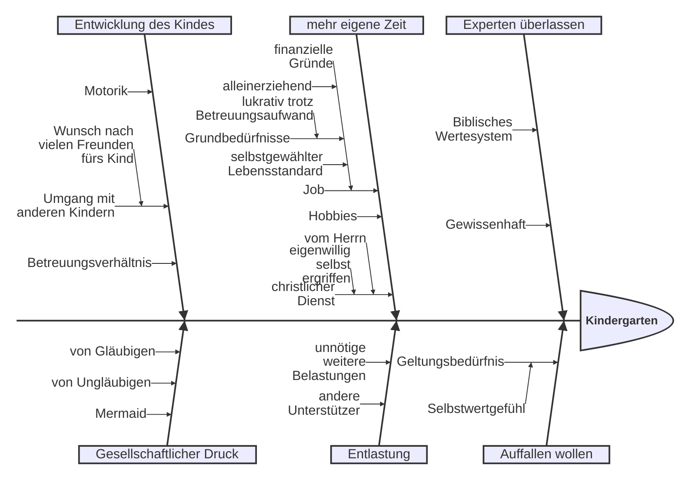

---
# try also 'default' to start simple
theme: default
# like them? see https://unsplash.com/collections/94734566/slidev
# background: https://cover.sli.dev
# some information about your slides (markdown enabled)
title: Jetzt zählts'!
info: |
  Heute dankbar und entschlossen mit Ziel dienen
# apply UnoCSS classes to the current slide
titleTemplate: '%s'
class: text-center
# slide transition: https://sli.dev/guide/animations.html#slide-transitions
transition: slide-left
# enable Comark Syntax: https://comark.dev/syntax/markdown
comark: true
# favicon: 'https://cdn.jsdelivr.net/gh/slidevjs/slidev/assets/favicon.png'
---

# Jetzt zählt's

<Tooltip text="die die gelegene Zeit auskaufen, denn die Tage sind böse." href="https://www.csv-bibel.de/bibel/1-mose-42#v38">Epheser 5,16</Tooltip>

---
layout: two-cols-header
transition: slide-up
---

::left::

# Intro

Dankbar leben.

Bewusst dienen.

Ganz im Hier und Jetzt.

::right::

<Toc text-sm minDepth="1" maxDepth="1" />

---
layout: image-right
image: /images/life-overview.png
backgroundSize: 94%
---

# Dankbar

 

Heute

 
 

<Tooltip
  text="Und der Friede des Christus regiere in euren Herzen, zu dem ihr auch berufen worden seid in einem Leib; und seid dankbar. (Kol 3,15)"
  href="https://www.csv-bibel.de/bibel/kolosser-3#v15"
>
  Kolosser 3,15
</Tooltip>

---
layout: image-left
image: /images/ravensbrueck.jpg
level: 2
---

# Dankbar

 

## Allgmein

 

---
layout: image-right
image: /images/tagbogen.avif
backgroundSize: 99%
level: 2
---

# Tagverlauf

- Teenie
- 20er
- Eltern junger Kinder

---
level: 2
transition: slide-up
---

# 🗯️ Austausch # 1

 

Versetzt euch in die Lage älterer Gruppenmitglieder. Nennt den jeweils Älteren diejenigen Dinge, wofür sie eurer Vorstellung nach besonders dankbar sein dürfen.

 
 

 💡 Tipp: Zuhören, nicht widersprechen.

---
layout: image
image: /images/zielscheibe.jpg
---

# Ziel

<Tooltip text="Denn welche er zuvorerkannt hat, die hat er auch zuvorbestimmt, dem Bild seines Sohnes gleichförmig zu sein, damit er der Erstgeborene sei unter vielen Brüdern" href="https://www.csv-bibel.de/bibel/roemer-8#v29">Römer 8,29</Tooltip>

---
level: 2
transition: slide-up
---

# 🗯️ Austausch # 2

 
 

1. Bei welchen Ziel-Aspekten fällt es dir besonders schwer, dich mit zu identifizieren.
1. Warum?

---
level: 1
class: text-center
# background: verschwommene Zielscheibe
---

# Was zählt? Über Prioritäten & Fokus

---
class: text-center bg-black text-white
---

# Stille Zeit

---
level: 2
class: text-center
# background: Kinderzimmer, Büro auf einem Bild
---

# Evangelisieren

---
level: 2
class: text-center
layout: image
image: /public/images/zielscheibe.jpg
# backgroundSize: contain
backgroundSize: 50%
# background: what's app status screenshot durchgestrichen
---

# Was nicht entscheidend ist

## dfdfd

normaler text

---
level: 1
layout: cover
background: 
---

# Let ~~them~~/him, let me

---
level: 2
transition: slide-up
---

# 🗯️ Austausch # 3

 

1. Notiere dir deine persönlichen `let him`-Themen
1. Bei welchem Thema fällt es dir besonders schwer, es an IHN abzugeben?
1. Warum fällt es dir schwer?
1. Tauscht euch über positive und negative Erfahrungen aus, die ihr beim "Abgeben" bereits gesammelt habt.

---

# Warum - Selbstreflexion

---
level: 2
transition: slide-up
---

# 🗯️ Austausch # 4

 

Ihr steht vor der Entscheidung, außen an eurem eigenen Haus ein 2x3m großes Bibel-Plakat anzubringen.

1. Sammelt gemeinsam Gründe, die die dagegen sprechen.
2. Hinterfragt mit mehrfachen "Warums", wie ihr zu diesen Gründen kommt und ob sie biblisch haltbar sein.

---

# 🚀 

 

Phil 3,13f

Heb 12,1

1 Joh 2,20

Off 22,20

1 Kor 15,58

---
layout: image-right
image: /images/qrcode.svg
backgroundSize: 90%
---

# Nimm mit!

 

## Quellen

Photo by [Becca Romine](https://unsplash.com/@brecca85?utm_source=unsplash&utm_medium=referral&utm_content=creditCopyText) Romine on [Unsplash](https://unsplash.com/photos/faded-green-lights-digital-wallpaper-Lll4QeybDEg?utm_source=unsplash&utm_medium=referral&utm_content=creditCopyText)

https://pixabay.com/photos/accuracy-dart-goal-direct-hit-454196/

https://waitbutwhy.com/2014/05/life-weeks.html

https://www.ravensbrueck-sbg.de/en/history/1939-1945/

https://www.spektrum.de/news/was-ist-zeit/1168976
